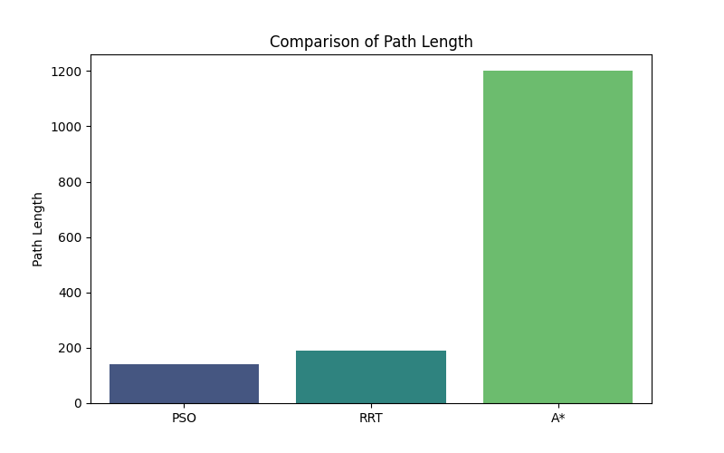
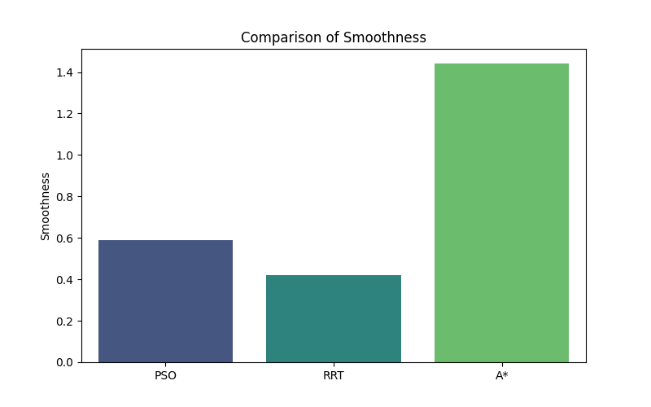
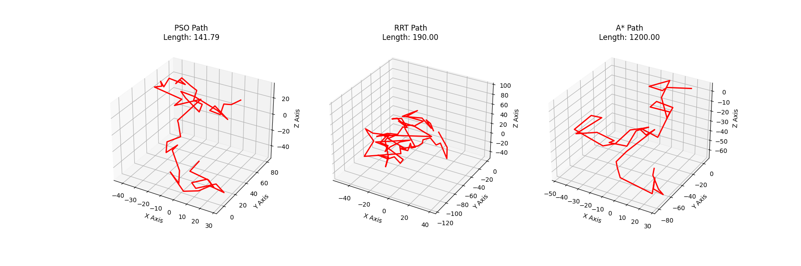
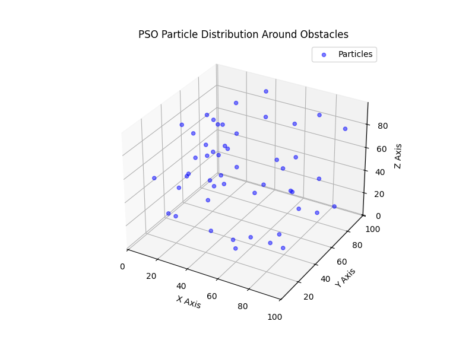

# Path Planning Algorithm Analysis

## Overview
This document provides an in-depth analysis of three path planning algorithms: **Particle Swarm Optimization (PSO), Rapidly-exploring Random Tree (RRT), and A***. Each algorithm is evaluated based on key performance metrics to determine its suitability for various real-world applications.

---

## 1. Path Length Analysis

### Definition
Path length is the total distance traveled from the start to the goal along the computed path.

### Importance
- Shorter paths typically indicate more efficient navigation.
- Longer paths may suggest inefficiencies or unnecessary detours.

### Results Interpretation
- **PSO** (141.79) → Moderate-length path, benefiting from swarm optimization.
- **RRT** (190.00) → Longer path due to random exploration and suboptimal connections.
- **A*** (1200.00) → Very long path, likely due to exhaustive node expansion.

### Significance in Real Applications
- **Autonomous vehicles** and **drones** prefer shorter paths to reduce fuel consumption.
- **Robotics** benefits from shorter paths to minimize execution time and mechanical wear.
- **Warehouse automation** relies on shorter paths for higher efficiency.

---

## 2. Smoothness Analysis

### Definition
Smoothness is the degree to which the path avoids sudden direction changes, measured by angular variations along the trajectory.

### Importance
- Smoother paths are **safer and more feasible** for real-world movement.
- Sharp turns increase mechanical stress and **slow down movement**.

### Results Interpretation
- **PSO** (0.59) → Smoothest path due to global trajectory optimization.
- **RRT** (0.42) → Less smooth due to random sampling.
- **A*** (1.44) → Least smooth due to frequent sharp turns in a discrete grid.

### Significance in Real Applications
- **Self-driving cars** prefer smooth paths for safety and comfort.
- **Robotic arms** require smooth paths to prevent damage.
- **Drones** need smooth paths to maintain stability.

---

## 3. Execution Time Analysis

### Definition
Execution time is the total computational time required to generate a valid path.

### Importance
- Faster algorithms allow real-time decision-making.
- Slow algorithms may be impractical for **dynamic environments**.

_comparison.png)

### Results Interpretation
- **PSO** (153.78s) → Longest computation time due to iterative optimization.
- **RRT** (80.93s) → Moderate time, as it builds a tree incrementally.
- **A*** (41.21s) → Fastest, following a heuristic-driven search.

### Significance in Real Applications
- **Real-time robotics** (e.g., search & rescue, Mars rovers) need fast execution.
- **Game AI pathfinding** must be fast for smooth gameplay.
- **Surgical robots** require quick adaptability.

---

## 4. Path Quality Visualization

### Definition
A 3D plot of the computed paths allows visual inspection of efficiency, smoothness, and obstacle avoidance.

### Importance
- Provides **intuitive understanding** of algorithm performance.
- Helps detect **collisions, detours, or inefficiencies**.

### Results Interpretation
- **PSO Path:** Well-optimized and smooth, avoiding obstacles.
- **RRT Path:** More erratic, with unnecessary deviations.
- **A* Path:** Direct but with sharp turns due to grid constraints.

### Significance in Real Applications
- **Robotic simulations** use this before real-world deployment.
- **AI-driven logistics** optimize delivery efficiency.
- **Aerospace navigation** relies on optimized paths for efficiency.

---

## 5. Particle Distribution Analysis (PSO-specific)

### Definition
A scatter plot showing how PSO particles are distributed in the search space, avoiding obstacles and converging towards the goal.

### Importance
- Demonstrates how PSO **explores the environment**.
- Shows if particles **converge effectively**.

### Results Interpretation
- Particles **distribute widely at first**, then converge near the optimal path.
- **Good convergence** means PSO finds an optimal solution efficiently.

### Significance in Real Applications
- **Swarm robotics** (e.g., drone fleets) use PSO-based task allocation.
- **Traffic management AI** optimizes congestion-based routing.
- **Satellite navigation** benefits from PSO’s optimization capabilities.

---

## 7. Final Takeaways

| **Metric**      | **PSO** | **RRT** | **A*** | **Best For** |
|---------------|---------|--------|------|------------|
| **Path Length** | Short  | Long  | Very Long  | Efficient routing |
| **Smoothness** | High  | Medium  | Low | Robotics & drones |
| **Execution Time** | Slow  | Medium  | Fast | Real-time systems |
| **Convergence** | Optimized | No guarantee | Systematic | AI-based planning |
| **Path Quality** | High | Erratic | Sharp turns | Visual validation |
| **Particle Analysis** | Adaptive | Not applicable | Not applicable | Swarm-based systems | 

